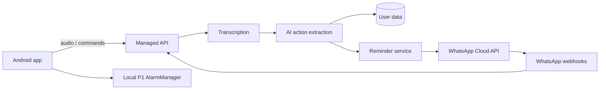

# Voice Catcher product plan

## Vision

Voice Catcher is a private Android companion for people who think faster than they can organize. A person speaks naturally—"remind me at 5 to have lunch", "add milk and coffee", or "I finished the report"—and the assistant captures, understands, and follows through without becoming noisy or judgmental.

The Android app is the reliable command center. WhatsApp is the familiar conversation channel: the assistant sends the daily plan, handles natural-language replies, and runs an evening check-in.

## User and launch scope

- First user: the product owner only, using a private pilot account.
- Platform: Android 8.0+ initially; iOS and multi-user support are later work.
- Voice: English and Hinglish, including natural Indian date/time phrasing.
- Data: recordings, transcripts, tasks, reminders, and conversations remain until the user deletes them. The product offers item deletion, account-wide deletion, and data export.
- Task source: the built-in task workspace. Calendar and third-party task sync are deferred.

## Core experience

### Capture

The home screen has one dominant press-and-hold capture control. After stopping, the app records a local audio note and eventually sends it to the protected backend for transcription and typed intent extraction.

Supported first-release intents:

- Create tasks, notes, lists, and recurring routines.
- Create P1 alarms and P2 reminders.
- Ask what is due today or what remains incomplete.
- Mark tasks done, postpone them, change priority, and add more detail.
- Plan the day and report progress during the evening review.

Routine, high-confidence task capture is automatic. The assistant confirms an ambiguous date/time or any risky action: alarms, external messages, deletions, and material schedule changes.

### P1 and P2 reminders

| Class | Purpose | Delivery | Reliability rule |
| --- | --- | --- | --- |
| P1 | Urgent, exact-time action | Android local exact alarm, full-screen reminder, sound, snooze, done | Always local; must operate offline. |
| P2 | Low-pressure prompt or routine | WhatsApp approved template when possible; Android push notification fallback | Message status is recorded; no repeated nagging. |

### Daily companionship

- During onboarding, the user selects a morning-plan time and evening-review time.
- The morning plan gives today’s priorities, time-bound work, and a compact task list.
- At most one helpful daytime check-in is sent when it is relevant.
- The evening review asks what was completed, what should move, and whether tomorrow needs planning.
- The assistant is calm, clear, and non-judgmental. Quiet hours and frequency controls are always available.

## WhatsApp design

- Use a dedicated WhatsApp Business Platform number for the assistant. The user chats from their personal WhatsApp account.
- Onboarding records explicit WhatsApp opt-in and associates the personal phone number with the private pilot account.
- Use approved Meta templates for proactive P2 messages, the morning plan, and evening review.
- Reply naturally inside the customer-service window after the user messages the assistant.
- A WhatsApp message is never the only delivery mechanism for P1.

WhatsApp permits free-form business replies only in the 24-hour customer-service window; proactive messaging outside it requires approved templates. See the [WhatsApp Business Policy](https://whatsappbusiness.com/policy/?faq=5).

## Technical architecture

### Android

- Kotlin, Jetpack Compose, Material 3, Room, WorkManager, AlarmManager, Firebase Cloud Messaging.
- Foreground audio capture with explicit microphone permission.
- Local P1 alarms are rescheduled after reboot and react correctly to time-zone changes.
- Queue offline captures securely, upload on connectivity, and prevent duplicate action application.

### Backend

- Managed services: Firebase Authentication, Firestore, Cloud Storage, Cloud Functions/Cloud Run, Secret Manager, and a scheduled-job service.
- Backend-only AI and WhatsApp credentials; no secret is embedded in the app.
- AI returns a typed action plan: action type, entity data, date/time, priority, confidence, and whether confirmation is required.
- Verify WhatsApp webhook signatures; process incoming messages idempotently; persist delivery status.

### Privacy and security

- Encrypt data in transit and at rest; restrict all backend access to the signed-in pilot account.
- Do not place raw audio, transcripts, phone numbers, or assistant content in operational logs.
- Display every interpretation and action in an auditable timeline.
- Support individual deletion, full-account deletion, and portable export before inviting more users.

## Data model

- `Capture`: encrypted audio reference, transcript, captured time, processing state, source.
- `Task`: title, notes, status, priority, due time, recurrence, source capture, completion time.
- `Reminder`: P1/P2, scheduled time, time zone, delivery state, alarm/message identifiers, snooze state.
- `ConversationEvent`: incoming/outgoing message, delivery state, linked action, channel.
- `ActionAudit`: AI interpretation, confidence, user confirmation, resulting changes, failure reason.

## Failure behavior

- Failed transcription: retain the original capture and offer retry or manual task entry.
- Low confidence/unclear time: ask a direct clarification; do not silently schedule an alarm.
- No network: retain capture locally and schedule P1 locally when a date/time was explicitly confirmed.
- WhatsApp unavailable, template rejected, or delivery fails: mark the status and send Android notification fallback for P2.
- Duplicate upload/webhook: ignore the repeated event using stable capture/message IDs.
- Missed alarm: display the overdue reminder on unlock and record it for the next daily plan.

## Delivery roadmap

1. **Foundation** — Compose app, microphone capture, task/reminder model, privacy-first project structure.
2. **Reliable Android** — Room persistence, P1 exact alarms, notification controls, timeline, and reboot recovery.
3. **Assistant intelligence** — secure transcription, typed AI actions, confirmation cards, Hinglish evaluation set.
4. **WhatsApp companion** — dedicated business number, templates, webhook processing, daily plan, evening review.
5. **Expansion** — habits, weekly reviews, calendar/Todoist integrations, Android widget, wearables, then multi-user support.

## Acceptance criteria

- A user can capture a note in under ten seconds and see its recorded state.
- A confirmed P1 item rings at the intended time while offline and supports snooze/done actions.
- Natural English/Hinglish capture correctly handles tasks, relative times, several actions in one message, and an ambiguous-time clarification path.
- The morning plan and evening review appear at the configured times without more than one unnecessary daytime prompt.
- WhatsApp template, delivery, fallback, and reply statuses appear in the app timeline.
- Data export/delete and all permission-denied paths are clear and functional.
