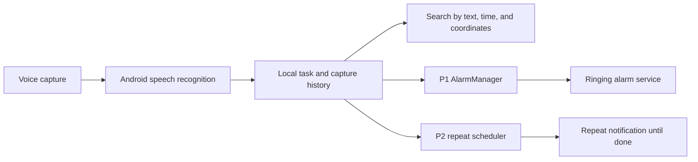

# Voice Catcher product plan

## Vision

Voice Catcher is a private Android companion for people who think faster than they can organize. A person speaks naturally—"remind me at 5 to have lunch", "add milk and coffee", or "I finished the report"—and the assistant captures, understands, and follows through without becoming noisy or judgmental.

The Android app is the complete command center. It uses on-device alarms and notifications, with no dependency on WhatsApp or a cloud messaging account.

## User and launch scope

- First user: the product owner only, using a private pilot account.
- Platform: Android 8.0+ initially; iOS and multi-user support are later work.
- Voice: English and Hinglish, including natural Indian date/time phrasing.
- Data: recordings, transcripts, tasks, reminders, and conversations remain until the user deletes them. The product offers item deletion, account-wide deletion, and data export.
- Task source: the built-in task workspace. Calendar and third-party task sync are deferred.

## Core experience

### Capture

The home screen has one dominant voice-capture control. The app uses Android speech recognition, stores the transcript locally, and records the capture time and available precise location.

Supported first-release intents:

- Create tasks, notes, lists, and recurring routines.
- Create P1 alarms and P2 reminders.
- Ask what is due today or what remains incomplete.
- Mark tasks done, postpone them, change priority, and add more detail.
- Plan the day and report progress during the evening review.

Routine, high-confidence task capture is automatic. The assistant confirms an ambiguous date/time or any risky action: alarms, external messages, deletions, and material schedule changes.

### P1 and P2 reminders

| Class | Purpose | Delivery | Reliability rule |
| --- | --- | --- | --- |
| P1 | Urgent, exact-time action | Android local exact alarm, full-screen reminder, sound, snooze, done | Always local; must operate offline. |
| P2 | Routine reminder | Repeating Android notification | Repeats at the user-selected interval until marked done. |

### Daily companionship

- During onboarding, the user selects a morning-plan time and evening-review time.
- The morning plan gives today’s priorities, time-bound work, and a compact task list.
- At most one helpful daytime check-in is sent when it is relevant.
- The evening review asks what was completed, what should move, and whether tomorrow needs planning.
- The assistant is calm, clear, and non-judgmental. Quiet hours and frequency controls are always available.

## Technical architecture

### Android

- Kotlin, Jetpack Compose, Material 3, shared local storage, Android speech recognition, and AlarmManager.
- Microphone, notification, exact-alarm, and precise-location permissions are requested explicitly.
- Local P1 alarms are rescheduled after reboot and react correctly to time-zone changes.
- Queue offline captures securely, upload on connectivity, and prevent duplicate action application.

### Privacy and security

- Keep history on the device for the private pilot; location is stored only with user-granted access.
- Display every transcript, action, time, and coordinate in searchable history.
- Add export and deletion controls before inviting more users.

## Data model

- `Capture`: encrypted audio reference, transcript, captured time, processing state, source.
- `Task`: title, notes, status, priority, due time, recurrence, source capture, completion time.
- `Reminder`: P1/P2, scheduled time, time zone, delivery state, alarm/message identifiers, snooze state.
- `CaptureRecord`: transcript, capture time, location/accuracy, and outcome.

## Failure behavior

- Failed transcription: retain the original capture and offer retry or manual task entry.
- Low confidence/unclear time: ask a direct clarification; do not silently schedule an alarm.
- No network: retain capture locally and schedule P1 locally when a date/time was explicitly confirmed.
- Repeating P2 notification: schedule the next local occurrence until the task is marked done.
- Duplicate upload/webhook: ignore the repeated event using stable capture/message IDs.
- Missed alarm: display the overdue reminder on unlock and record it for the next daily plan.

## Delivery roadmap

1. **Foundation** — Compose app, microphone capture, task/reminder model, privacy-first project structure.
2. **Reliable Android** — Room persistence, P1 exact alarms, notification controls, timeline, and reboot recovery.
3. **Assistant intelligence** — better local parsing, confirmation cards, and Hinglish evaluation set.
4. **Daily companion** — morning plan, evening review, habits, and weekly review.
5. **Expansion** — calendar/Todoist integrations, Android widget, wearables, then multi-user support.

## Acceptance criteria

- A user can capture a note in under ten seconds and see its recorded state.
- A confirmed P1 item rings at the intended time while offline and supports snooze/done actions.
- Natural English/Hinglish capture correctly handles tasks, relative times, several actions in one message, and an ambiguous-time clarification path.
- A P2 item repeats at the configured interval until the user marks it done from the app or notification.
- Search finds captures by transcript, recorded time, and visible coordinates.
- Data export/delete and all permission-denied paths are clear and functional.
